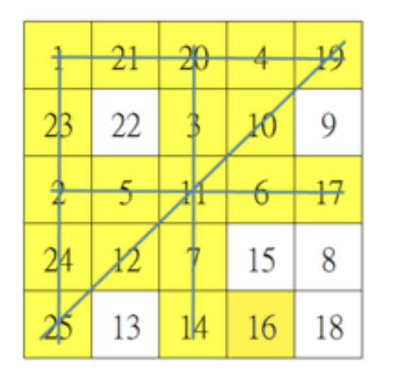

# BINGO

## Information
``` 

    Author      :       Lee Kai Pui
    Student ID  :       210339487
    Lanuage     :       Java

    Moudle      :       ITP 3914 - Programming
    Course      :       IT114105 - HP in Software Enginereeing
    Create Date :       19-10-2021

```

***
## How to run ?

``` 
java -cp "bin' Main
```

If you hava make

```
make excute
```
***


## Description 
A simple Bingo game run on the console. [Example](https://youtu.be/ANwucID0vAo)


The porgram will display two players' card on the screen. To meet the requirment of the assignment , the arrangememt of 25 numbers on the cards are ***fixed*** by default. Also , a game host need to input a number to program. According to the corresponding number on players' cards, the game will mark a "XX" to replace the number if the number are the same. The program will terminate when player / players win. 

***
## How to win the game?

A player finds the selected numbers are arranged on their card in same row / column / diagonal . 



